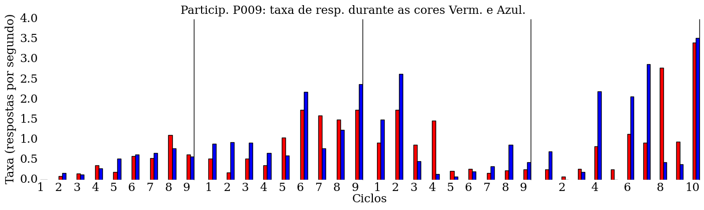
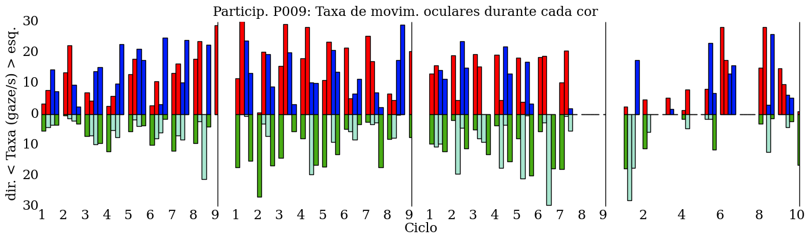

Figura 1: Respostas ao botão. Taxa de respostas ao botão durante vermelho e azul, ao longo das condições A e B. Legenda: Condição `A`= Vermelho(S+) e Azul(S+), Condição `B`= Vermelho(S+) e Azul(S-).

Figura 2: Taxa de movimentos oculares durante cada cor (vermelho, verde, azul, ciano), de acordo com as categorias esquerda e direita, ao longo das condições A e B. **Dados sem correção, categorias usando dbscan**. Legenda: Condição `A`= Vermelho(S+) e Azul(S+), Condição `B`= Vermelho(S+) e Azul(S-).

Figura 3: Taxa de movimentos oculares durante cada cor (vermelho, verde, azul, ciano), de acordo com as categorias esquerda e direita, ao longo das condições A e B. **Dados corrigidos usando quantis, categorias usando critério espacial**. Legenda: Condição `A`= Vermelho(S+) e Azul(S+), Condição `B`= Vermelho(S+) e Azul(S-).